# OPENGPU

The goal of this project is to develop a simple GPU.

## Project Description
A project to create a simplified GPU implementation with chisel, featuring TileLink-based memory interfaces for better cache coherence support.

```mermaid
%%{
  init: {
    'theme': 'dark',
    'themeVariables': {
      'primaryColor': '#ff6b6b',
      'primaryTextColor': '#ffffff',
      'primaryBorderColor': '#ff6b6b',
      'lineColor': '#4ecdc4',
      'secondaryColor': '#45b7d1',
      'tertiaryColor': '#96ceb4',
      'clusterBkg': 'rgba(33,33,33,0.8)',
      'clusterBorder': '#666666',
      'fontFamily': 'Inter, system-ui, sans-serif',
      'fontSize': '14px',
      'nodeSpacing': 50,
      'rankSpacing': 80
    }
  }
}%%

flowchart TB
  %% Software Layer
  subgraph sw["🖥️ Software Layer"]
    style sw fill:#2d3748,stroke:#4a5568,stroke-width:2px
    subgraph apps["📱 Applications"]
      style apps fill:#4a5568,stroke:#718096,stroke-width:1px
      app1["OpenCL App"]
      app2["CUDA App"]
      app3["Graphics App"]
    end
    
    subgraph drivers["🔧 Drivers & APIs"]
      style drivers fill:#4a5568,stroke:#718096,stroke-width:1px
      driver1["OpenCL Runtime"]
      driver2["CUDA Runtime"]
      driver3["Graphics Driver"]
    end
  end

  %% Hardware Interface Layer
  subgraph hw_if["🔌 Hardware Interface"]
    style hw_if fill:#2d3748,stroke:#4a5568,stroke-width:2px
    subgraph queues["📋 Queue Management"]
      style queues fill:#4a5568,stroke:#718096,stroke-width:1px
      sq1["Software Queue"]
      sq2["Hardware Queue"]
      qs["Queue Scheduler"]
    end
  end

  %% Dispatch Layer
  subgraph dispatch["🚀 Dispatch Layer"]
    style dispatch fill:#2d3748,stroke:#4a5568,stroke-width:2px
    subgraph job_disp["📦 Job Dispatchers"]
      style job_disp fill:#4a5568,stroke:#718096,stroke-width:1px
      jd1["Job Dispatcher"]
      wgd1["WorkGroup Dispatcher"]
    end
  end

  %% Compute Unit Layer
  subgraph cu["🖥️ Compute Unit"]
    style cu fill:#2d3748,stroke:#4a5568,stroke-width:2px
    
    subgraph frontend["🎯 Frontend"]
      style frontend fill:#4a5568,stroke:#718096,stroke-width:1px
      ws["Warp Scheduler"]
      fq["Fetch Queue"]
      fe["Frontend"]
      wf["Warp Frontend"]
    end
    
    subgraph pipeline["⚡ Execution Pipeline"]
      style pipeline fill:#4a5568,stroke:#718096,stroke-width:1px
      dp["Decode Pipe"]
      id["Instruction Decoder"]
      sb["Scoreboard"]
      rf["Register File"]
      ss["SIMT Stack"]
    end
    
    subgraph exec["🔧 Execution Units"]
      style exec fill:#4a5568,stroke:#718096,stroke-width:1px
      alu_issue["ALU Issue"]
      alu_exe["ALU Execution"]
      fpu_issue["FPU Issue"]
      fpu_exe["FPU Execution"]
      vec_dec["Vector Decoder"]
    end
    
    subgraph mem["💾 Memory System"]
      style mem fill:#4a5568,stroke:#718096,stroke-width:1px
      icache["I-Cache"]
      gcache["G-Cache"]
      tlb["TLB"]
    end
  end

  %% Memory Layer
  subgraph memory["💾 Memory Hierarchy"]
    style memory fill:#2d3748,stroke:#4a5568,stroke-width:2px
    subgraph cache["🏗️ Cache System"]
      style cache fill:#4a5568,stroke:#718096,stroke-width:1px
      l1i["L1 I-Cache"]
      l1d["L1 D-Cache"]
      l2["L2 Cache"]
      vrf["Vector Register File"]
    end
    
    subgraph dram["💿 External Memory"]
      style dram fill:#4a5568,stroke:#718096,stroke-width:1px
      ddr["DDR Memory"]
    end
  end

  %% Data Flow Connections
  %% Software to Hardware
  app1 --> driver1
  app2 --> driver2
  app3 --> driver3
  driver1 --> sq1
  driver2 --> sq2
  driver3 --> sq2
  
  %% Queue Management
  sq1 --> qs
  sq2 --> qs
  
  %% Dispatch Layer
  qs --> jd1
  jd1 --> wgd1
  
  %% Compute Unit
  wgd1 --> cu
  
  %% Internal CU Connections
  ws --> fq
  fq --> fe
  fe --> wf
  wf --> dp
  dp --> id
  id --> sb
  sb --> rf
  rf --> ss
  
  %% Execution Units
  sb --> alu_issue
  sb --> fpu_issue
  sb --> vec_dec
  alu_issue --> alu_exe
  fpu_issue --> fpu_exe
  
  %% Memory Access
  fe --> icache
  icache --> tlb
  alu_exe --> gcache
  fpu_exe --> gcache
  gcache --> tlb
  
  %% Memory Hierarchy
  icache --> l1i
  gcache --> l1d
  l1i --> l2
  l1d --> l2
  l2 --> ddr
  
  %% Vector Processing Highlight
  vec_dec -.->|"RISC-V Vector Extension"| vrf

```

## Current Status and Future Work

### Current Status
- Core Architecture : The project is building a GPU core based on the RISC-V Vector (RVV) extension. It includes fundamental execution units like Instruction Issue (Issue Stage), ALU, and FPU, along with parameter configurations for the Vector Register File (VRF) and VectorCore.
- Instruction Set Support : Currently focuses on the RISC-V Vector (RVV) extension instructions.
- Modular Design : The code structure demonstrates a modular approach with subdirectories such as core , dispatcher , fpu , and vector .
- Memory Interface : Successfully migrated from AXI4 to TileLink protocol for better cache coherence support. Both ICache and DCache now use TileLink interfaces.

### Future Work
To achieve a complete GPU functionality, beyond the existing foundation, the following aspects typically need to be considered and developed:

1. More Comprehensive Instruction Set Support : Besides RVV, GPUs usually have specialized instruction sets for graphics rendering (e.g., texture sampling, pixel operations) and general-purpose computing (e.g., atomic operations, synchronization instructions).
2. Graphics Rendering Pipeline :
   - Vertex Processing : Vertex shaders, geometry shaders.
   - Rasterization : Converting geometric primitives into pixels.
   - Fragment Processing : Fragment shaders, texture units, depth testing, stencil testing, blending.
   - Output Merger : Writing processed fragments to the framebuffer.
3. General-Purpose Compute Units (GPGPU) :
   - More Complex Execution Units : Beyond ALUs and FPUs, specialized units for accelerating matrix operations, tensor operations, etc., might be needed to support machine learning and high-performance computing workloads.
   - Memory Model and Synchronization Mechanisms : Support for shared memory, atomic operations, barrier synchronization, etc., to enable efficient parallel computation.
4. Memory Hierarchy :
   - Multi-level Caches : In addition to VRF, implementing L1/L2 caches and shared memory is crucial for optimizing data access performance.
   - Video Memory Controller : Interface and management for external DRAM (video memory).
   - TileLink Interconnect : Enhanced cache coherence support using TileLink protocol for better memory system integration.
5. Scheduling and Control Logic :
   - Warp/Thread Block Scheduling : More sophisticated schedulers to efficiently manage and dispatch a large number of warps/thread blocks, maximizing hardware utilization.
   - Context Switching : Efficiently switching between different tasks.
6. Bus and Interconnect : Internal data paths and interfaces with external systems (e.g., CPU).
7. Drivers and Software Stack : While this is a hardware project, a complete GPU ecosystem requires corresponding drivers and high-level APIs (e.g., OpenGL, Vulkan, DirectX, OpenCL, CUDA) to allow software developers to leverage the hardware capabilities.
8. Power and Performance Optimization : Clock gating, power management, and pipeline optimization should be considered during the RTL design phase to achieve target power and performance goals.

## Documentation

For detailed information about OPENGPU, see the documentation in the `docs/` directory:

- **[Architecture Guide](docs/ARCHITECTURE.md)** - System architecture and component overview
- **[TileLink Integration Guide](docs/TILELINK_INTEGRATION.md)** - TileLink protocol implementation details
- **[Development Guide](docs/DEVELOPMENT_GUIDE.md)** - Setup, building, testing, and development workflow

## License
MIT License
