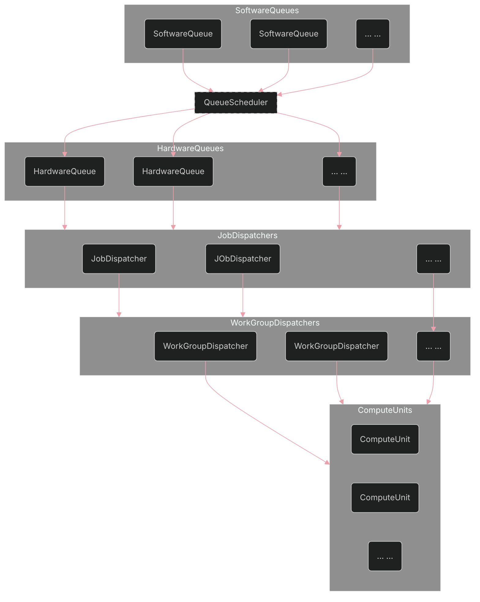

# OPENGPU

The goal of this project is to develop a simple GPU.

## Project Description
A project to create a simplified GPU implementation with chisel.

```mermaid
%%{
  init: {
    'theme': 'dark',
    'themeVariables': {
      'lineColor': 'rgb(235, 160, 172)',
      'clusterBkg': 'rgba(33,33,33,0.5)',
      'fontFamily': 'Inter',
      'fontSize': '14px'
    }
  }
}%%

flowchart TD
  subgraph sqs[SoftwareQueues]
    sq0(SoftwareQueue)
    sq1(SoftwareQueue)
    sqn(... ...)
  end

  subgraph qs[QueueScheduler]
    style qs stroke-dasharray: 5 5
  end

  subgraph hqs[HardwareQueues]
    hq0(HardwareQueue)
    hq1(HardwareQueue)
    hqn(... ...)
  end

  subgraph jd[JobDispatchers]
    jd1(JobDispatcher)
    jd2(JObDispatcher)
    jdn(... ...)
  end

  subgraph wgd[WorkGroupDispatchers]
    wgd1(WorkGroupDispatcher)
    wgd2(WorkGroupDispatcher)
    wgdn(... ...)
  end

  subgraph cus[ComputeUnits]
    cu1(ComputeUnit)
    cu2(ComputeUnit)
    cun(... ...)
  end

  sq0 --> qs
  sq1 --> qs
  sqn --> qs
  qs --> hq0
  qs --> hq1
  qs --> hqn
  hq0 --> jd
  hq1 --> jd
  hqn --> jd

  jd1 --> wgd
  jd2 --> wgd
  jdn --> wgdn

  wgd1 --> cus
  wgd2 --> cus
  wgdn --> cus

```

## License
MIT License

